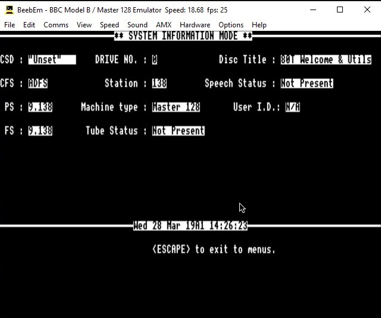
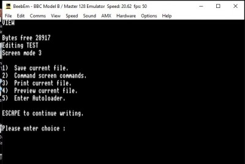

# Autoloader for the Acorn BBC Micro

**Autoloader** is a BBC Micro ROM originally written in 6502 assembly using the ADE ROM assembler.  
Its primary purpose is to automatically launch the VIEW word processor when VIEW-format files are selected, extend the VIEW menu, and detect the filesystem type (DFS, ADFS, or ANFS). Optional Winchester-style chimes can also be played every 15 minutes.

---

## Features

- Auto-detect file systems: DFS, ADFS, ANFS  
- Automatically launch VIEW for VIEW-format files  
- Extended VIEW menu accessible after exiting editing  
- Optional Winchester-style chimes  
- ADE source preserved for historical authenticity  
- Autoload support from `$.Library._HH`  

---

## Repository Structure

The project is organised as follows:

```
Autoloader-BBC/
├── src/               Source code (.ADE, include files, workspace files)
├── rom/               Compiled ROM images (built output)
├── docs/              Additional documentation
├── screenshots/       Images showing ROM behaviour
└── README.md          Main project overview (this file)

```

---
## Screenshots


  
  
  


---

- **Key points:**  
  - Remove the triple backticks (```) around the images.  
  - Keep the image syntax: ``.  
  - You can add two spaces at the end of a line (`  `) to force a line break between images if needed.

## Built ROM

The compiled ROM image(s) can be found in the `rom/` folder. Example:

```
rom/autoloader.rom
```

---

## Building the ROM on a BBC Micro (Using ADE)

This project can be built on a real BBC Micro or emulator using ADE (Advanced Disk Editor).

### Required ADE ROMs

To build this project on a BBC Micro, you will need:

- `ADEasm` – ADE assembler ROM
- `ADEmmu` – ADE MMU ROM

You can find them in the [TobyLobster ROM Library](https://tobylobster.github.io/rom_library/?md5=3500b9c6409477fcaeb70c20a41061cd). Search for `ADEasm` or `ADEmmu` to download the appropriate image.

### Step 1 — Load ADE ROMs into Sideways RAM (Classic Method)

On a BBC Master (or compatible machine with sideways RAM), you can load ROM images manually into slots using the “inconvenient” standard method:

1. **Insert the disc containing the ADE ROM images** (ADEasm, ADEmmu).  

2. **Choose a free sideways slot** — e.g., 4 for ADEasm, 5 for ADEmmu.  

3. **Load the ROM into memory**:

```
*LOAD ADEasm 8000
*LOAD ADEmmu 8000
```

- `8000` is the start address in sideways RAM.  
- The ROM is loaded into memory but not yet active.

4. **Initialise the ROMs**:

- Activate the ROMs in their slots:

```
*SWITCH 4
*SWITCH 5
```

- Alternatively, on some Masters, **press <Ctrl> + Break** to initialise the newly loaded ROMs.  

5. **Verify loaded ROMs** (optional):

```
*FX 4
*FX 5
```

- This will list the contents of the selected sideways slots. ADEasm and ADEmmu should appear.  

> ⚠️ Notes:
> - You must manually track which slots are free to avoid conflicts.  
> - This method is slower and less convenient than using an automated loader, but it works on any Master without extra helper code.  

---


### Step 2 — Change to the source directory
Navigate to the folder containing the AUTOLAUNCH wrapper and source:

*DIR <your-source-directory>

### Step 3 — Assemble the ROM
Run ADE with the AUTOLAUNCH wrapper file:

*ASM AUTOLAUNCH

### Step 4 — Output ROM
ADE will assemble starting at &8000.
If AUTOLAUNCH contains a SAVE statement, the ROM will be written automatically.

Otherwise, save manually:

*SAVE AUTOLOADER &8000 &BFFF

This creates a ROM image suitable for a sideways ROM socket or emulator.

---

## Building the ROM on Windows/Linux/Mac (Using BeebAsm)

This project can also be assembled using the modern BeebAsm assembler.

### Requirements
Install BeebAsm:

Windows:
  Download binary from: https://github.com/stardot/beebasm/releases

Linux / macOS:
  git clone https://github.com/stardot/beebasm
  make

### Step 1 — Go to the project folder

cd Autoloader-BBC

### Step 2 — Assemble the ROM

beebasm -i src/main/autoloader_main.asm -o rom/Autoloader.rom -v

(You can replace the input path with your actual main source file.)

### Step 3 — Load the ROM in an emulator

BeebEm:
  File → Load ROM → choose rom/Autoloader.rom → Slot 4

B-Em:
  Hardware → Load ROM → select slot → choose rom/Autoloader.rom

### Notes
- INCLUDE paths may need adjusting for BeebAsm (uses `.include "file"` syntax)
- Workspace definitions may need slight conversion
- All logic, routines, and labels will assemble identically once syntax updates are made

---


## License

This repository does not include a license by default. Use at your own discretion.